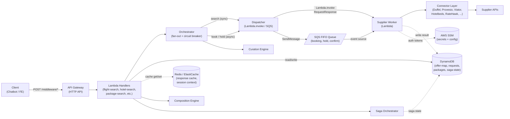

# Architecture

The Al Rais middleware is a **serverless aggregation layer** that sits between the consumer-facing travel chatbot and a heterogeneous network of supplier APIs (GDS feeds, OTA aggregators, content providers, enrichment services). Its core job is to accept a single search or booking request, fan it out to every relevant supplier in parallel, normalize the disparate responses into a single canonical schema, curate the results down to a shortlist, and return a unified response -- all within a tight latency budget.

Three principles shape every design decision:

1. **Supplier-agnostic normalization.** No supplier-specific data type ever leaks beyond its connector module. Every result is transformed into a canonical `Normalized*Offer` before it reaches the orchestration or curation layers.
2. **Fan-out / fan-in with partial-failure tolerance.** Suppliers are called concurrently via `Promise.allSettled`. If one supplier times out or returns an error, the remaining results are still returned. Per-supplier circuit breakers prevent cascading failures.
3. **Serverless-first, event-driven.** All compute runs on AWS Lambda (Node.js 20, arm64). Synchronous paths (search, fare rules) use direct `Lambda.invoke`. Asynchronous mutation paths (booking, hold, confirm) flow through an SQS FIFO queue. State lives in DynamoDB; hot caches live in Redis (ElastiCache).

---

## System Dataflow



**Read the diagram left-to-right.** Solid lines are synchronous request/response flows. Dashed lines are async or side-channel writes.

---

## Connector Layer

The connector layer is the only place where supplier-specific code exists. Every supplier integration follows the same contract defined by the `SupplierConnector` interface.

### The `SupplierConnector` Interface

```typescript
export interface SupplierConnector {
  /** Supplier identifier (e.g., 'provesio', 'duffel') */
  readonly name: string;
  /** What this connector can do */
  readonly capabilities: SupplierCapability[];
  /** Auth strategy instance */
  readonly auth: SupplierAuth;

  // Flight operations
  searchFlights?(request: FlightSearchRequest): Promise<SupplierFlightResult>;
  bookFlight?(request: FlightBookRequest): Promise<BookingReference>;
  holdFlight?(request: FlightBookRequest): Promise<BookingReference>;
  cancelFlight?(orderId: string): Promise<{ cancelled: boolean; ... }>;
  getFareRules?(offerId: string): Promise<Record<string, unknown>>;

  // Hotel operations
  searchHotels?(request: HotelSearchRequest): Promise<SupplierHotelResult>;
  bookHotel?(offerId: string, guestDetails: Record<string, unknown>): Promise<BookingReference>;

  // Activity operations
  searchActivities?(request: ActivitySearchRequest): Promise<SupplierActivityResult>;
  bookActivity?(request: ActivityBookRequest): Promise<BookingReference>;

  // Transfer operations
  searchTransfers?(request: TransferSearchRequest): Promise<SupplierTransferResult>;
  bookTransfer?(request: TransferBookRequest): Promise<BookingReference>;

  // Insurance, visa, destination enrichment ...
  // (additional optional methods)

  initialize?(): Promise<void>;
  healthCheck?(): Promise<SupplierHealthStatus>;
}
```

Key design decisions:

- **Optional methods + capabilities array.** The orchestrator checks `connector.capabilities.includes('flight_search')` before calling `searchFlights()`. This lets suppliers be onboarded incrementally -- a new hotel-only connector does not need to stub out flight methods.
- **Each connector owns its own normalizer.** A `normalizer.ts` file inside each connector folder transforms raw supplier responses into the canonical `Normalized*Offer` types. No supplier-native shapes propagate beyond the connector boundary.
- **Auth is pluggable.** Each connector carries its own `SupplierAuth` implementation. The middleware supports six auth strategies today:

| Auth Strategy | Connectors | Mechanism |
|---|---|---|
| `SessionAuth` | Provesio | Login endpoint, Redis-cached session ID |
| `BearerAuth` | Duffel, Tavily | Static API key from SSM |
| `HmacAuth` | Hotelbeds | `SHA256(apiKey + secret + epoch)` per request |
| `ApiKeyAuth` | Viator, Foursquare, BudgetYourTrip | Static key in request header |
| `BasicAuth` | RateHawk/ETG | HTTP Basic (keyId:apiKey) |
| `NoAuth` | Visa (static data), Teleport, Open-Meteo | No external authentication |

### Connector Registry

All connectors are registered in a central `ConnectorRegistry` at Lambda cold start:

```typescript
export class ConnectorRegistry {
  private connectors = new Map<string, SupplierConnector>();

  register(connector: SupplierConnector): void { ... }
  get(name: string): SupplierConnector | undefined { ... }
  getByCapability(capability: SupplierCapability): SupplierConnector[] { ... }
  list(): string[] { ... }
  async initializeAll(): Promise<void> { ... }
}
```

The factory function `createDefaultRegistry(config)` wires up all active connectors based on which API keys are present in the configuration. A connector whose key is absent is simply skipped -- no error, no stub.

### Registered Connectors

| Connector | Supplier | Capabilities | Phase |
|---|---|---|---|
| `ProvesioFlightConnector` | Provesio (legacy gateway) | `flight_search`, `flight_book` | 1 |
| `DuffelFlightConnector` | Duffel | `flight_search`, `flight_book`, `flight_fare_rules` | 1 |
| `DuffelStaysConnector` | Duffel Stays | `hotel_search`, `hotel_book` | 1 |
| `HotelbedsHotelConnector` | Hotelbeds | `hotel_search`, `hotel_book`, `hotel_details` | 1 |
| `RateHawkHotelConnector` | RateHawk / ETG | `hotel_search`, `hotel_book` | 1 |
| `ViatorActivityConnector` | Viator | `activity_search`, `activity_book`, `activity_details`, `activity_cancel`, `activity_booking_questions` | 1 |
| `ViatorTransferConnector` | Viator | `transfer_search`, `transfer_book`, `transfer_cancel` | 1 |
| `VisaStaticConnector` | Static dataset | `visa_check` | 1 |
| `TeleportCityInsightConnector` | Teleport | `city_insight` | 2 |
| `OpenMeteoWeatherConnector` | Open-Meteo | `weather_forecast` | 2 |
| `BudgetYourTripConnector` | BudgetYourTrip | `travel_budget` | 2 |
| `TavilySearchConnector` | Tavily AI | `destination_intel` | 2 |
| `FoursquarePlacesConnector` | Foursquare | `poi_search` | 2 |

---

## Orchestration Layer

The orchestration layer coordinates multi-supplier fan-out, applies circuit breaking, and hands results to the curation and composition engines.

### Search Orchestrator

The `Orchestrator` class is the central coordinator for search operations. Its pipeline:

1. **Build message envelopes.** One `SupplierMessage` per supplier, stamped with a `correlationId`, the `module:operation` key (e.g., `flight:search`), and the request payload.
2. **Fan out.** All messages are dispatched in parallel via `Promise.allSettled()`. Each call is wrapped with a per-supplier timeout and a circuit breaker check.
3. **Collect partial results.** Suppliers that time out or error are logged with a `SupplierStatusEntry` but do not block the response. The remaining successful results are merged.
4. **Normalize and deduplicate.** The normalizer dispatches raw results to per-supplier normalizer functions. Cross-supplier duplicates (same flight, same routing, different supplier) are collapsed.
5. **Curate.** The curation engine scores every offer and selects the top three: **Best Overall**, **Best Value**, and **Fastest**.

Per-supplier timeouts are tuned individually:

| Supplier | Timeout (ms) | Circuit Breaker Threshold |
|---|---|---|
| Provesio | 8,000 | 5 failures / 60 s |
| Duffel | 8,000 | 3 failures / 60 s |
| Duffel Stays | 6,000 | 3 failures / 60 s |
| Hotelbeds | 5,000 | 3 failures / 60 s |
| RateHawk | 30,000 | 3 failures / 60 s |
| Viator | 4,000 | 5 failures / 60 s |
| Teleport | 3,000 | 5 failures / 60 s |
| Open-Meteo | 3,000 | 5 failures / 60 s |
| Foursquare | 3,000 | 5 failures / 60 s |
| Tavily | 5,000 | 3 failures / 60 s |
| BudgetYourTrip | 4,000 | 3 failures / 60 s |

### Circuit Breaker

Each supplier has an independent circuit breaker with three states:

```
CLOSED (normal) --> OPEN (blocked) --> HALF_OPEN (probe) --> CLOSED
```

- **CLOSED:** All requests pass through. Failures are counted within a rolling window. When failures exceed the threshold, the circuit transitions to OPEN.
- **OPEN:** All requests are rejected immediately (the supplier is skipped). After a `resetTimeout` elapses, the circuit transitions to HALF_OPEN.
- **HALF_OPEN:** One probe request is allowed. Success closes the circuit; failure reopens it.

Circuit breaker state is held in-memory within the Lambda execution context. In a warm Lambda, the breaker persists across invocations; a cold start resets it.

### Curation Engine

The curation engine is a pure, deterministic scoring function with no I/O or side effects. It evaluates every normalized offer against a weighted rule set:

| Rule | What It Scores |
|---|---|
| `price` | Lower price = higher score |
| `duration` | Shorter total travel time = higher score |
| `stops` | Fewer stops = higher score |
| `departure_time` | Preference for daytime departures |
| `family_compatibility` | Child-friendly carriers, baggage allowance |
| `carrier` | Preferred airline matching |
| `freshness` | More recently fetched offers score higher |

When the trip is not a family booking, the family rule's weight is redistributed proportionally across the other rules. After scoring, the engine selects three distinct offers using the `selectThree` algorithm:

- **Best Overall** -- highest composite score
- **Best Value** -- lowest price among top-half scorers
- **Fastest** -- shortest total duration

Each selected offer gets a natural-language explanation and tradeoff annotations (e.g., "Cheapest option, but 2 h longer than the fastest").

Domain-specific curation engines exist for hotels (`hotel-engine.ts`) and activities (`activity-engine.ts`) with their own rule sets.

### Composition Engine

The composition engine assembles multi-component travel packages from individual offers:

1. **Wrap** normalized offers as `PackageComponent[]` (flight + hotel + activity + transfer + insurance).
2. **Validate** cross-component compatibility (e.g., hotel check-in date aligns with flight arrival, transfer pickup covers airport-to-hotel).
3. **Price** the bundle via the `BundlePricingEngine` -- per-module margins, bundle discount tiers, yield adjustment, and a minimum margin floor (never sells below cost + 2%).
4. **Annotate** with a cancellation summary derived from each component's policy.
5. **Return** a `NormalizedPackageOffer` with full price breakdown, compatibility report, and curation score.

### Saga Orchestrator

Multi-step booking operations (hold all components, then confirm all) are managed by a saga state machine:

```
createSaga --> executeStep (per component) --> compensate (on failure)
```

- Each step maps to a supplier operation (e.g., `flight:hold`, `hotel:hold`).
- State is persisted to DynamoDB after every transition.
- If any step fails, the saga triggers **compensation** -- all previously completed steps are rolled back in reverse order using the `COMPENSATION_MAP`:

```typescript
const COMPENSATION_MAP = {
  book: 'cancel',
  hold: 'cancel',
  confirm: 'cancel',
};
```

A `HoldManager` tracks the effective hold window across all components (minimum expiry across all active holds). A scheduled Lambda (`holdExpiryWorker`) scans for expiring holds every minute and triggers compensation before supplier-side holds lapse.

---

## Queue & Dispatch

The middleware uses two invocation modes, both routed through the same `Dispatcher` abstraction:

### Synchronous Path (Search, Fare Rules)

```
Handler --> Orchestrator --> Dispatcher.invokeWorker(message)
  --> Lambda.invoke(supplierWorker, RequestResponse)
    --> Worker: registry.get(supplier) --> connector.searchFlights()
  <-- WorkerResult
```

The orchestrator calls `Lambda.invoke` with `InvocationType: 'RequestResponse'` for user-waiting paths. The supplier worker Lambda processes the message and returns a `WorkerResult` synchronously.

### Asynchronous Path (Booking, Hold, Confirm)

```
Handler --> Orchestrator --> Dispatcher.sendToQueue(message)
  --> SQS FIFO Queue (MessageGroupId = supplier)
    --> bookingWorker (SQS event source, batchSize=1)
      --> Worker: processMessage() --> connector.bookFlight()
      --> DynamoDB: write ResultRecord
Handler (poll) --> RequestStore.getResult(correlationId) --> ResultRecord
```

Mutation operations are sent to an SQS FIFO queue with the supplier name as `MessageGroupId` (guarantees per-supplier ordering). The booking worker Lambda consumes messages one at a time (`batchSize: 1`, `reservedConcurrency: 10`). Results are written to the `requests` DynamoDB table keyed by `correlationId`. The client polls a status endpoint until the result appears.

The FIFO queue has a dead-letter queue (DLQ) with `maxReceiveCount: 3`. Failed messages are retained in the DLQ for 14 days.

### Message Envelope

Both paths use the same `SupplierMessage` envelope:

```typescript
interface SupplierMessage<P = unknown> {
  messageId: string;        // UUID per message
  correlationId: string;    // ties request -> result -> status
  module: OperationModule;  // 'flight' | 'hotel' | 'activity' | 'transfer' | 'insurance' | 'package'
  operation: Operation;     // 'search' | 'book' | 'hold' | 'confirm' | 'cancel' | ...
  supplier: string;         // matches ConnectorRegistry key
  payload: P;               // module+operation specific payload
  authContext: { authorizationHeader: string; userId?: string };
  packageContext: PackageContext | null;
  meta: { createdAt: string; source: string; attempt: number; sagaId?: string };
  idempotencyKey?: string;
}
```

The worker never branches on how it was invoked. Both the direct-invoke `handler()` and the SQS `sqsHandler()` call the same `processMessage()` function. Dispatch to the correct connector method is handled by a `module:operation` routing table in `dispatch.ts`.

---

## Data Layer

### DynamoDB Tables

All tables use on-demand (PAY_PER_REQUEST) billing and have TTL enabled.

| Table | Purpose | Key Schema | TTL |
|---|---|---|---|
| `offer-map` | Maps middleware UUIDs to supplier offer IDs + session context | `pk` (middleware offer ID), `sk` (supplier) | 30 min |
| `requests` | Tracks async booking/hold/confirm status | `pk` (correlationId), `sk` (operation) | Yes |
| `search-events` | Data capture for analytics (search initiated, offer selected, etc.) | `pk`, `sk` | Yes |
| `packages` | Composed package records with GSI on `userId` | `pk` (packageId), `sk`; GSI: `userId` | Yes |
| `package-holds` | Per-component hold tracking for saga coordination | `pk` (packageId), `sk` (module) | Yes |
| `saga-state` | Saga definitions and step statuses | `pk` (sagaId), `sk` (stepId) | Yes |
| `compensation-incidents` | Audit log for compensation (rollback) events | `pk`, `sk` | Yes |
| `viator-destinations` | Viator destination taxonomy cache; GSIs on `iataCode` and `nameNormalized` | `pk`, `sk`; GSI: `iataCode`, `nameNormalized` | Yes |
| `viator-catalog` | Viator product catalog cache with GSI on `destinationId` | `pk`, `sk`; GSI: `destinationId` | Yes |

### Redis Cache (ElastiCache)

Redis is used for short-lived caches where DynamoDB's latency would be too high. All cache operations are **fail-open** -- a Redis error returns a cache miss, never blocks the request.

| Cache Key Pattern | Data | TTL |
|---|---|---|
| `middleware:flights:{hash}` | Normalized flight search results | 120 s |
| `middleware:hotels:{hash}` | Normalized hotel search results | 60 s |
| `middleware:activities:{hash}` | Activity search results | 300 s |
| `middleware:transfers:{hash}` | Transfer search results | 300 s |
| `middleware:reviews:{productCode}` | Product review aggregates (UGC) | 3,600 s |
| `middleware:booking-questions:{productCode}` | Supplier booking question sets | 86,400 s |
| `middleware:destinations:{name}` | Destination taxonomy lookups | 86,400 s |
| `middleware:offer-map:{id}` | Offer map entries (fast path) | 1,800 s |

Cache keys are deterministic SHA-256 hashes of sorted search parameters, ensuring the same query always hits the same key regardless of parameter ordering.

### Supabase (Admin / Auth)

Supabase is used by the frontend and admin layer for:

- **Authentication** -- JWT-based user sessions
- **Admin configuration** -- pricing rules, package templates, supplier priority overrides, yield configuration

The middleware reads admin config via dedicated loader modules (`rule-loader.ts`, `template-loader.ts`, `yield-config-loader.ts`).

---

## Configuration

All configuration is environment-driven, with a two-tier resolution strategy:

1. **Production:** Secrets and config are stored in **AWS SSM Parameter Store** under the path `/{stage}/middleware/{key}` with encryption (`WithDecryption: true`). Values are cached in-memory for the lifetime of the Lambda execution context (warm reuse).
2. **Dev / Test:** Values are read directly from `process.env`, typically populated by a `.env` file.

The `loadConfig()` function is called once at Lambda cold start and produces a typed `MiddlewareConfig` object. No handler or connector reads `process.env` directly for secrets.

```typescript
interface MiddlewareConfig {
  stage: string;
  region: string;
  defaultCurrency: string;       // default: 'AED'
  redis: { host: string; port: number; tls: boolean };
  legacy: { flightApiUrl: string };
  duffel: { accessToken: string };
  viator?: { apiKey: string; apiBase?: string; ... };
  hotelbeds?: { apiKey: string; secret: string; baseUrl?: string };
  ratehawk?: { keyId: string; apiKey: string; baseUrl?: string };
  budgetYourTrip?: { apiKey: string };
  tavily?: { apiKey: string };
  foursquare?: { apiKey: string };
  workerFunctionName: string;
  bookingQueueUrl: string;
  requestTableName: string;
  searchEventTableName: string;
}
```

Optional supplier blocks (`viator?`, `hotelbeds?`, `ratehawk?`, etc.) control which connectors are registered. If a supplier's API key is absent from SSM, the connector is simply not instantiated -- no error, no degraded mode.

### Per-Connector Settings

Beyond API keys, some connectors accept additional configuration:

- **Viator:** Custom `apiBase` URL, DynamoDB table names for destination taxonomy and product catalog.
- **Hotelbeds:** Custom `baseUrl` (defaults to production endpoint).
- **RateHawk:** Custom `baseUrl`, separate `keyId` and `apiKey` for Basic Auth.
- **Redis:** Host, port, TLS toggle, password (for non-IAM auth clusters).

### Scheduled Workers

Two scheduled Lambda workers maintain background data:

| Worker | Schedule | Purpose |
|---|---|---|
| `viatorCatalogSync` | Every 6 hours | Incremental sync of Viator product catalog and availability schedules |
| `viatorDestinationRefresh` | Every 24 hours | Full refresh of Viator destination taxonomy |
| `holdExpiryWorker` | Every 1 minute | Scan for package holds expiring within 2 minutes, trigger saga compensation |
