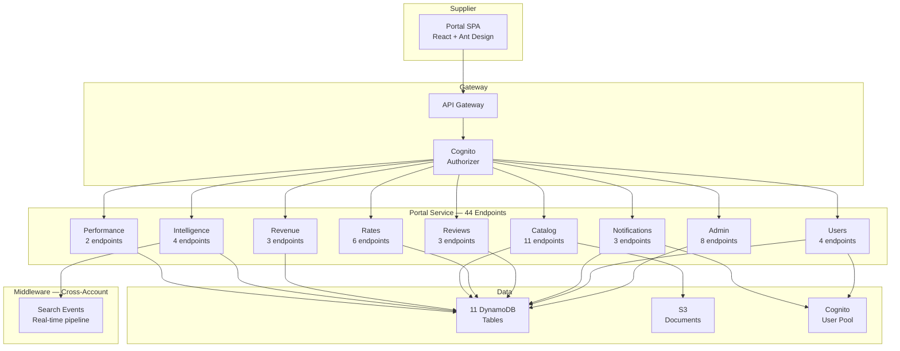
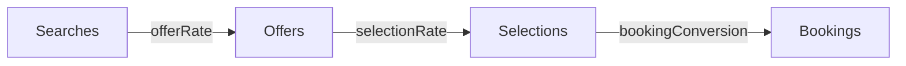
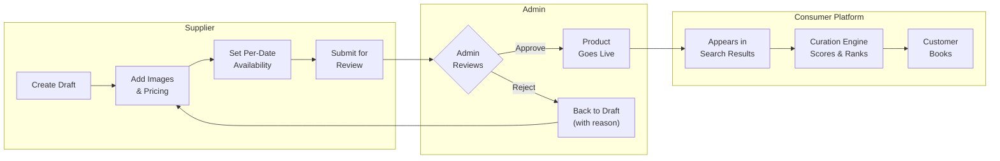
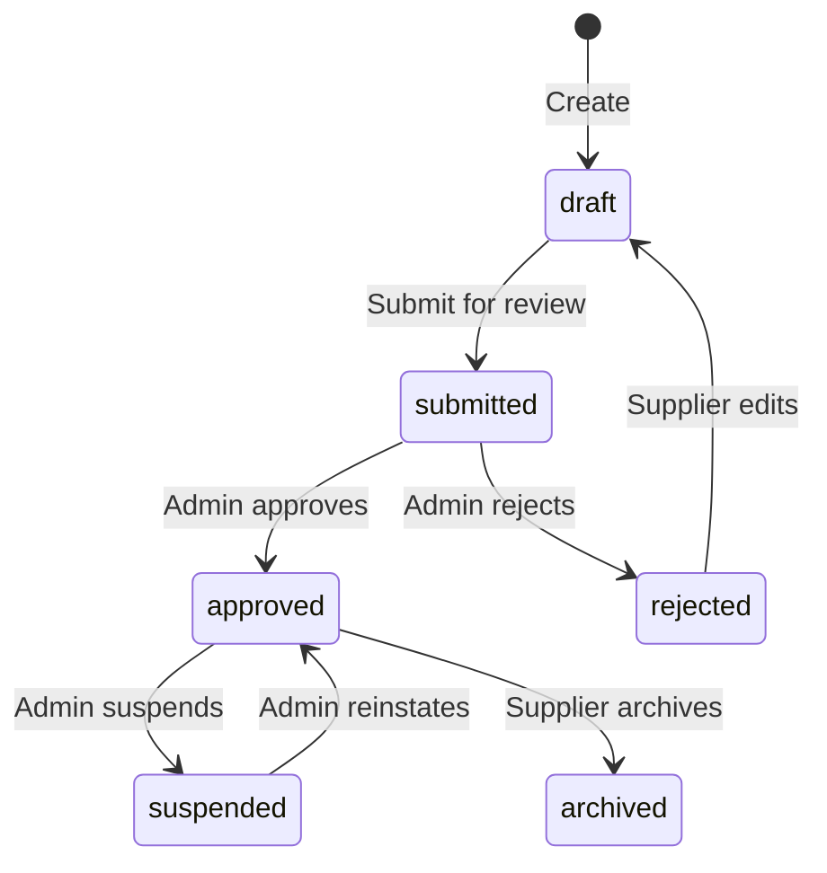
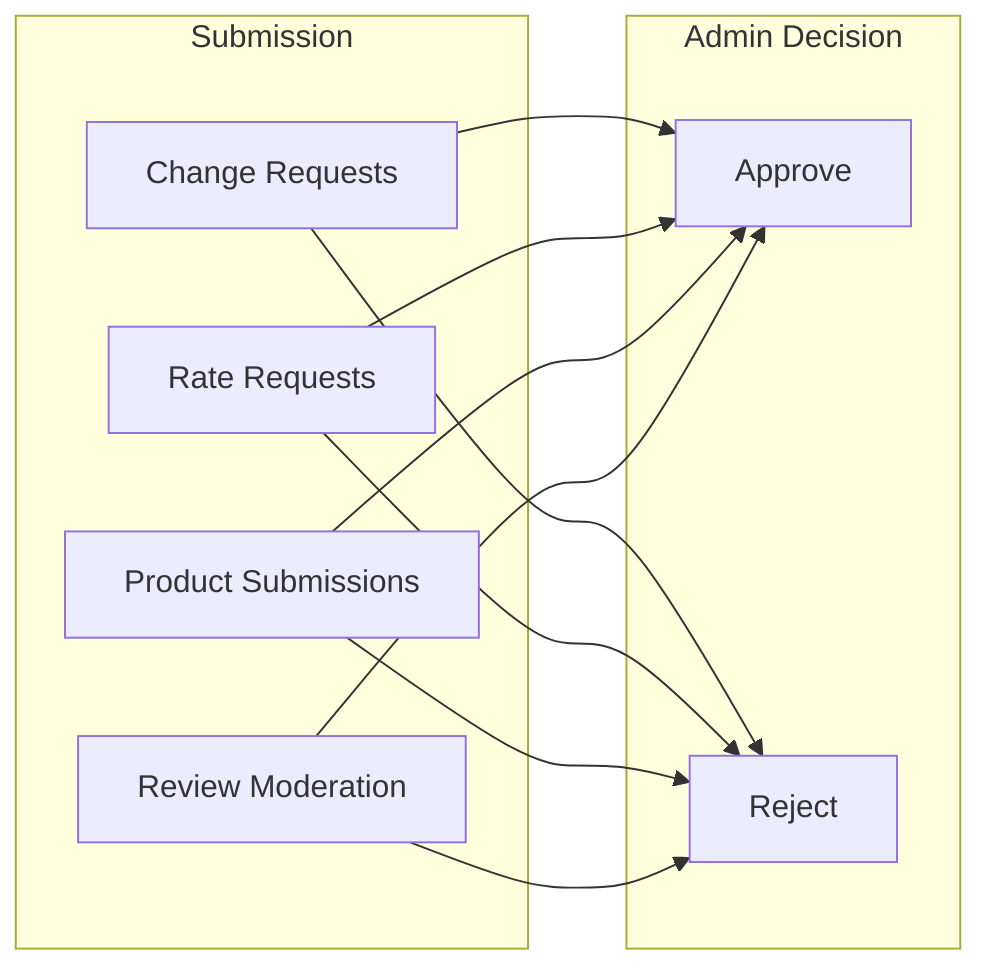

# Al Rais Supplier Portal — Capability Showcase

> A managed supplier marketplace for travel. Suppliers list tours, packages, and transfers. Admins review and approve. Approved products go live for customers. 44 endpoints. 11 data tables. Real-time competitive intelligence. Built for the GCC travel ecosystem.

---

## 01 — The Portal

The Al Rais Supplier Portal is a **managed marketplace** where travel suppliers create, price, and publish their product offerings to the Al Rais consumer platform. Suppliers list tours, multi-module packages (flight + hotel + activity), and airport transfers. Every listing goes through an admin approval workflow before it reaches customers. Once live, suppliers get real-time visibility into competitive positioning, revenue, and booking conversion — all through a unified API surface secured by 3-tier RBAC.

### System Architecture



### Platform at a Glance

| Metric | Value |
|--------|-------|
| REST Endpoints | 44 |
| DynamoDB Tables | 11 |
| Auth Model | AWS Cognito JWT + Lambda authorizer |
| RBAC Tiers | 3 (`viewer` → `api_manager` → `admin`) |
| Deployment | Serverless Framework on AWS Lambda |
| Cross-Account Data | Middleware search events (real-time) |
| Product Types | 3 (tours, packages, transfers) |
| Report Formats | CSV + JSON |

### RBAC Hierarchy

```
admin          ─── Full platform access, approvals, reports, moderation
  │
api_manager    ─── Create/edit products, submit rates, manage blackouts
  │
viewer         ─── Read-only dashboards, intelligence, revenue
```

Every request is scoped to the supplier identity in the JWT. Admins can access cross-supplier data through dedicated `/admin/` endpoints.

---

## 02 — Intelligence API

The Intelligence API gives suppliers anonymized competitive positioning data. No competitor identities are revealed — only aggregate percentile rankings and market context.

### Competitive Metrics

| Metric | Source | What It Tells You |
|--------|--------|-------------------|
| **Price Win Rate** | `intelligence/price-position` | How often your price is the lowest in the market |
| **Price Win Percentile** | `intelligence/price-position` | Your price competitiveness rank among all suppliers |
| **Curation Selection Rate** | `intelligence/curation-scores` | How often the curation engine picks your offers |
| **Offer Density** | `intelligence/curation-scores` | Average offers you return per search |
| **Overall Conversion** | `intelligence/conversion-funnel` | End-to-end: searches → bookings |

### Conversion Funnel



| Stage | Definition |
|-------|-----------|
| **Searches** | Number of marketplace searches where you participated |
| **Offers** | Number of offers your system returned |
| **Selections** | Times the curation engine selected your offer as a winner |
| **Bookings** | Confirmed customer bookings |

### Route-Level Drilldown

The `/intelligence/routes` endpoint breaks down competitive data by origin–destination pair:

| Field | Description |
|-------|-------------|
| `searchCount` | Your search participation on this route |
| `winRate` | Your win percentage vs. competitors |
| `competitorSearchCount` | Total route activity across all suppliers |
| `competitionLevel` | `high` (5+ suppliers), `medium` (3–4), `low` (1–2) |
| `avgLatencyMs` | Your average response time on this route |
| `availability` | Your uptime percentage on this route |

**Example response — top route:**

```json
{
  "route": "DXB-LHR",
  "searchCount": 350,
  "winRate": 28.0,
  "competitorSearchCount": 1400,
  "competitionLevel": "high",
  "avgLatencyMs": 1200,
  "availability": 98.5
}
```

---

## 03 — Performance Dashboard

The Performance Dashboard exposes 8 KPIs that define supplier health in the marketplace.

### KPI Inventory

| # | KPI | Unit | Source |
|---|-----|------|--------|
| 1 | **Search Participation** | count | Searches where supplier participated |
| 2 | **Offers Returned** | count | Valid offers sent back to marketplace |
| 3 | **Curation Wins** | count | Times selected by the curation engine |
| 4 | **Confirmed Bookings** | count | Customer-confirmed bookings |
| 5 | **Revenue** | currency | Gross booking value |
| 6 | **Availability** | % (0–100) | Uptime — successful responses / total requests |
| 7 | **Avg Latency** | ms | Average API response time |
| 8 | **Errors** | count | Failed responses + circuit breaker trips |

### Aggregation Levels

| Granularity | Sort Key Pattern | Retention |
|-------------|-----------------|-----------|
| Hourly | `HOURLY#{ISO timestamp}` | 7 days |
| Daily | `DAILY#{YYYY-MM-DD}` | 90 days |
| Monthly | `MONTHLY#{YYYY-MM}` | Indefinite |

### Timeseries API

The timeseries endpoint (`/performance/timeseries`) returns metric history for charting:

```json
{
  "timeseries": [
    { "timestamp": "2025-04-28T00:00:00Z", "searchCount": 450, "offerCount": 380, "winCount": 120, "bookingCount": 28, "avgLatencyMs": 1100, "availability": 99.2, "errorCount": 3, "revenue": 12400.00 }
  ]
}
```

Supports `hourly`, `daily`, and `monthly` granularity with custom date ranges.

---

## 04 — Product Catalog & Supplier Marketplace

The portal operates as a **managed supplier marketplace**. Suppliers create product listings — tours, multi-module packages, and airport transfers — and submit them for admin review. Approved products go live on the Al Rais consumer platform, where they appear in search results, get scored by the curation engine, and become bookable by customers.

### The Supplier Journey



1. **Create** — Supplier builds a product draft: title, description, location, images, cancellation policy, inclusions/exclusions, and type-specific details
2. **Price & Availability** — Per-date calendar with capacity limits, start times, and tiered pricing (adult/child/infant/group)
3. **Submit** — Draft enters the admin approval queue
4. **Admin Review** — Platform admin inspects content quality, pricing, policy clarity, and compliance. Approves or rejects with a written reason
5. **Live** — Approved products appear in consumer search, get curation-scored against competitors, and become bookable
6. **Iterate** — Rejected products return to draft. The supplier addresses feedback and resubmits. Pricing and availability updates on approved products take effect immediately without re-approval

### Product Types

| Type | Key Fields | Example |
|------|-----------|---------|
| **Tour** | Duration, booking questions, start times | Dubai Desert Safari (6h, evening departure) |
| **Package** | Components (flight + hotel + activity), duration nights | 5-Night Maldives All-Inclusive |
| **Transfer** | Vehicle type, max passengers, pickup/dropoff | Private sedan, DXB Airport → Hotel |

### Lifecycle State Machine



### What Happens After Approval

Once a product reaches `approved`:
- It enters the **consumer search index** for its destination/category
- The **curation engine** scores it alongside competing products using price position, supplier reliability, and quality signals
- Customers see it in **search results** with price, images, and cancellation policy
- **Bookings** flow through the middleware and appear in the supplier's revenue analytics
- The supplier can track per-product **performance** — impressions, wins, bookings, and revenue

### Endpoint Inventory (11 Endpoints)

| # | Method | Path | Auth | Action |
|---|--------|------|------|--------|
| 1 | GET | `/catalog` | Any | List products |
| 2 | POST | `/catalog` | `api_manager`+ | Create product |
| 3 | GET | `/catalog/{id}` | Any | Get product detail |
| 4 | PATCH | `/catalog/{id}` | `api_manager`+ | Update draft/rejected |
| 5 | DELETE | `/catalog/{id}` | `api_manager`+ | Delete product |
| 6 | POST | `/catalog/{id}/submit` | `api_manager`+ | Submit for review |
| 7 | POST | `/catalog/{id}/images` | `api_manager`+ | Upload image |
| 8 | GET | `/catalog/{id}/availability` | Any | Get availability |
| 9 | PUT | `/catalog/{id}/availability` | `api_manager`+ | Set availability |
| 10 | GET | `/admin/catalog` | `admin` | List all (cross-supplier) |
| 11 | PATCH | `/admin/catalog/{sid}/{id}` | `admin` | Approve/reject |

### Availability & Pricing

Each product has per-date availability with capacity tracking, multiple start times, and tiered pricing:

| Tier | Description |
|------|-------------|
| `adult` | Standard adult pricing |
| `child` | Child rate (typically 50% of adult) |
| `infant` | Infant rate (often free or minimal) |
| `group` | Volume discount with min/max pax requirements |

---

## 05 — Revenue Analytics

Three endpoints provide financial visibility at different zoom levels.

### Revenue Pyramid

```
┌──────────────────────────────────────────┐
│          Revenue Summary                  │
│   Gross booking value, avg booking value  │
│         bookingCount, winCount            │
├──────────────────────────────────────────┤
│           By Route                        │
│   Route-level revenue breakdown           │
│   DXB-LHR: $45K  │  DXB-BOM: $32K       │
├──────────────────────────────────────────┤
│           Trend                           │
│   Time-series: daily/weekly/monthly       │
│   Revenue + booking count over time       │
└──────────────────────────────────────────┘
```

### Endpoint Summary

| Endpoint | Returns |
|----------|---------|
| `/revenue/summary` | `grossBookingValue`, `bookingCount`, `avgBookingValue`, `winCount` |
| `/revenue/by-route` | Array of routes with per-route `revenue`, `bookingCount`, `avgBookingValue` |
| `/revenue/trend` | Time series of `{ period, revenue, bookingCount }` data points |

### Key Metrics

| Metric | Calculation |
|--------|-------------|
| **Gross Booking Value** | Sum of confirmed booking revenue in the period |
| **Avg Booking Value** | `grossBookingValue / bookingCount` |
| **Win Count** | Curation engine selections (superset of bookings) |
| **Revenue per Route** | Gross booking value attributed to specific origin–destination pairs |

---

## 06 — Notification Engine

The notification system manages three concerns: preference management, campaign tracking, and A/B testing.

### Preference Matrix

| Category | Email | In-App | SMS |
|----------|-------|--------|-----|
| Booking Alerts | configurable | configurable | configurable |
| Performance Reports | configurable | configurable | configurable |
| Rate Approvals | configurable | configurable | configurable |
| Product Updates | configurable | configurable | configurable |
| Platform News | configurable | configurable | configurable |
| Competitive Insights | configurable | configurable | configurable |

6 categories x 3 channels = **18 individual toggles** per supplier.

### Campaign Tracking

Campaign analytics track email engagement:

| Metric | Definition |
|--------|-----------|
| `sentCount` | Total notifications dispatched |
| `openCount` | Unique opens (pixel tracking) |
| `clickCount` | Unique link clicks |
| `openRate` | `openCount / sentCount * 100` |
| `clickRate` | `clickCount / sentCount * 100` |

### A/B Testing

Deterministic variant assignment using `hash(supplierId + testId) % variantCount`:

| Property | Description |
|----------|-------------|
| **Deterministic** | Same supplier always gets same variant |
| **Stateless** | No database lookup for assignment |
| **Even distribution** | Hash function ensures balanced split |

Each test produces per-variant metrics: `openRate`, `clickRate`, `conversionRate`, and a `winner` flag on the best-performing variant.

---

## 07 — Admin Console

The Admin Console provides platform-wide management capabilities accessible only to the `admin` role.

### Approval Workflows



| Workflow | Submitted By | What's Approved |
|----------|-------------|-----------------|
| **Change Requests** | Any user | Profile field changes (name, contact, address) |
| **Rate Requests** | `api_manager`+ | Corporate/promotional/seasonal discounts |
| **Product Submissions** | `api_manager`+ | New products transitioning from draft → live |
| **Review Moderation** | System | Customer reviews from pending → approved/rejected |

### Admin Endpoint Inventory

| # | Method | Path | Action |
|---|--------|------|--------|
| 1 | GET | `/admin/pending` | List all pending approvals |
| 2 | PATCH | `/admin/change-requests/{sid}/{rid}` | Approve/reject change request |
| 3 | PATCH | `/admin/rates/{sid}/{rid}` | Approve/reject rate |
| 4 | GET | `/admin/catalog` | List all products (cross-supplier) |
| 5 | PATCH | `/admin/catalog/{sid}/{pid}` | Approve/reject product |
| 6 | PATCH | `/admin/reviews/{rid}` | Moderate review |
| 7 | GET | `/admin/analytics/summary` | Platform summary |
| 8 | GET | `/admin/analytics/top-suppliers` | Supplier leaderboard |
| 9 | GET | `/admin/analytics/conversion-funnel` | Platform funnel |
| 10 | GET | `/admin/reports` | Generate CSV/JSON reports |
| 11 | GET | `/admin/campaigns/analytics` | Campaign engagement |
| 12 | GET | `/admin/ab-tests` | A/B test results |

### Report Generation

Reports support two output formats:

| Format | Content-Type | Delivery |
|--------|-------------|----------|
| JSON | `application/json` | Inline response body |
| CSV | `text/csv` | File download with `Content-Disposition` header |

Three report types: `bookings`, `revenue`, `supplier_performance` — each returning the top 50 suppliers ranked by the relevant metric.

---

## 08 — API Surface

Complete endpoint inventory: 44 endpoints across 10 functional groups.

### Performance (2 endpoints)

| Method | Path | Auth |
|--------|------|------|
| GET | `/portal/v1/performance/summary` | Any |
| GET | `/portal/v1/performance/timeseries` | Any |

### Intelligence (4 endpoints)

| Method | Path | Auth |
|--------|------|------|
| GET | `/portal/v1/intelligence/price-position` | Any |
| GET | `/portal/v1/intelligence/curation-scores` | Any |
| GET | `/portal/v1/intelligence/conversion-funnel` | Any |
| GET | `/portal/v1/intelligence/routes` | Any |

### Revenue (3 endpoints)

| Method | Path | Auth |
|--------|------|------|
| GET | `/portal/v1/revenue/summary` | Any |
| GET | `/portal/v1/revenue/by-route` | Any |
| GET | `/portal/v1/revenue/trend` | Any |

### Profile (4 endpoints)

| Method | Path | Auth |
|--------|------|------|
| GET | `/portal/v1/profile` | Any |
| PATCH | `/portal/v1/profile` | Any |
| GET | `/portal/v1/profile/change-request` | Any |
| POST | `/portal/v1/profile/change-request` | Any |

### Rates (6 endpoints)

| Method | Path | Auth |
|--------|------|------|
| GET | `/portal/v1/rates` | Any |
| POST | `/portal/v1/rates` | `api_manager`+ |
| DELETE | `/portal/v1/rates/{rateId}` | `api_manager`+ |
| GET | `/portal/v1/blackouts` | Any |
| POST | `/portal/v1/blackouts` | `api_manager`+ |
| DELETE | `/portal/v1/blackouts/{blackoutId}` | `api_manager`+ |

### Product Catalog (11 endpoints)

| Method | Path | Auth |
|--------|------|------|
| GET | `/portal/v1/catalog` | Any |
| POST | `/portal/v1/catalog` | `api_manager`+ |
| GET | `/portal/v1/catalog/{productId}` | Any |
| PATCH | `/portal/v1/catalog/{productId}` | `api_manager`+ |
| DELETE | `/portal/v1/catalog/{productId}` | `api_manager`+ |
| POST | `/portal/v1/catalog/{productId}/submit` | `api_manager`+ |
| POST | `/portal/v1/catalog/{productId}/images` | `api_manager`+ |
| GET | `/portal/v1/catalog/{productId}/availability` | Any |
| PUT | `/portal/v1/catalog/{productId}/availability` | `api_manager`+ |
| GET | `/portal/v1/admin/catalog` | `admin` |
| PATCH | `/portal/v1/admin/catalog/{supplierId}/{productId}` | `admin` |

### Reviews (3 endpoints)

| Method | Path | Auth |
|--------|------|------|
| POST | `/portal/v1/reviews` | Any |
| GET | `/portal/v1/reviews` | Any |
| PATCH | `/portal/v1/admin/reviews/{reviewId}` | `admin` |

### Notifications (3 endpoints)

| Method | Path | Auth |
|--------|------|------|
| GET | `/portal/v1/notifications/preferences` | Any |
| PATCH | `/portal/v1/notifications/preferences` | Any |
| POST | `/portal/v1/notifications/unsubscribe` | Any |

### Campaigns & A/B Testing (3 endpoints)

| Method | Path | Auth |
|--------|------|------|
| GET | `/portal/v1/admin/campaigns/analytics` | `admin` |
| GET | `/portal/v1/admin/ab-tests` | `admin` |
| POST | `/portal/v1/ab-tests/assign` | Any |

### Users (4 endpoints)

| Method | Path | Auth |
|--------|------|------|
| GET | `/portal/v1/users` | `admin` |
| POST | `/portal/v1/users/invite` | `admin` |
| PATCH | `/portal/v1/users/{email}/role` | `admin` |
| DELETE | `/portal/v1/users/{email}` | `admin` |

### Admin (4 endpoints)

| Method | Path | Auth |
|--------|------|------|
| GET | `/portal/v1/admin/pending` | `admin` |
| PATCH | `/portal/v1/admin/change-requests/{supplierId}/{requestId}` | `admin` |
| PATCH | `/portal/v1/admin/rates/{supplierId}/{rateId}` | `admin` |
| GET | `/portal/v1/admin/reports` | `admin` |

---

### Data Layer Summary

| Table | Partition Key | Records |
|-------|--------------|---------|
| `supplier-portal-metrics` | `SUPPLIER#{id}` / `PLATFORM#ALL` | Pre-aggregated performance data |
| `supplier-portal-users` | `SUPPLIER#{id}` | Portal user registry |
| `supplier-change-requests` | `SUPPLIER#{id}` | Profile change audit trail |
| `supplier-negotiated-rates` | `SUPPLIER#{id}` | Discount rate submissions |
| `supplier-blackout-dates` | `SUPPLIER#{id}` | Unavailability windows |
| `supplier-product-catalog` | `SUPPLIER#{id}` | Product definitions |
| `supplier-product-availability` | `PRODUCT#{id}` | Per-date capacity & pricing |
| `user-reviews` | `PRODUCT#{id}` | Customer reviews |
| `circuit-breaker-history` | — | Circuit state transitions |
| `search-events` | — | Cross-account middleware events |

---

*Built by [Epicmetry FZCO](https://epicmetry.com), Dubai.*
