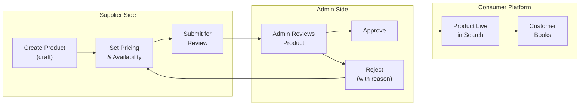
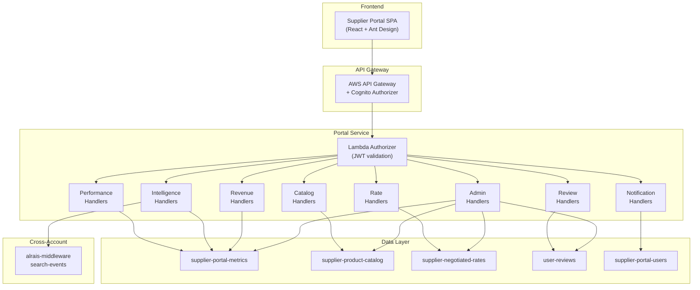

# Supplier Portal

The Al Rais Supplier Portal is a self-service marketplace platform where travel suppliers (airlines, hotel bedbanks, activity providers, transfer operators) manage their product listings, pricing, and availability on the Al Rais consumer marketplace. Approved products become searchable and bookable by customers on the consumer-facing platform.

Beyond catalog management, the portal gives suppliers real-time visibility into their competitive position, revenue performance, and booking conversion — and gives platform admins the tools to curate marketplace quality through approval workflows.

## Marketplace Model

The portal operates as a **managed marketplace**: suppliers create and submit product listings, but nothing goes live until a platform admin reviews and approves it. This applies to products, negotiated rates, and profile changes.



**What suppliers can do:**
- List tours, packages, and airport transfers with images, pricing tiers, and per-date availability
- Set negotiated rates (corporate, promotional, seasonal discounts) for specific routes
- Define blackout dates when they can't fulfill bookings
- Monitor how their products perform: search impressions, curation wins, bookings, revenue
- See anonymized competitive positioning vs. other suppliers on the same routes

**What admins control:**
- Approve or reject every product, rate, and profile change before it affects the marketplace
- Moderate customer reviews
- Access platform-wide analytics and downloadable reports
- Manage supplier portal user accounts and roles

## At a Glance

| Dimension | Value |
|-----------|-------|
| **Endpoints** | 44 REST endpoints across 10 modules |
| **Tables** | 11 DynamoDB tables |
| **Auth** | AWS Cognito JWT + 3-tier RBAC |
| **Deployment** | Serverless Framework on AWS Lambda |
| **API Version** | `v1` — all paths prefixed `/portal/v1/` |

## Architecture



## RBAC Model

The portal uses a 3-tier role-based access control model. Every request is scoped to the supplier associated with the authenticated user's Cognito identity.

| Role | Level | Capabilities |
|------|-------|-------------|
| `viewer` | 0 | Read-only access to performance, intelligence, revenue, and catalog data |
| `api_manager` | 1 | Everything in `viewer` + create/edit products, submit rates, manage blackouts |
| `admin` | 2 | Everything in `api_manager` + user management, approval workflows, platform analytics, review moderation, reports |

Higher roles inherit all permissions of lower roles.

## DynamoDB Tables

| Table | Partition Key | Sort Key | Purpose |
|-------|--------------|----------|---------|
| `supplier-portal-metrics` | `SUPPLIER#{id}` or `PLATFORM#ALL` | `DAILY#`, `MONTHLY#`, `HOURLY#` | Pre-aggregated performance and revenue metrics |
| `supplier-portal-users` | `SUPPLIER#{id}` | `USER#{email}` | Portal user registry with role assignments |
| `supplier-change-requests` | `SUPPLIER#{id}` | `REQUEST#{id}` | Profile change request audit trail |
| `supplier-negotiated-rates` | `SUPPLIER#{id}` | `RATE#{id}` | Corporate, promotional, seasonal rate submissions |
| `supplier-blackout-dates` | `SUPPLIER#{id}` | `BLACKOUT#{id}` | Date ranges where supplier is unavailable |
| `supplier-product-catalog` | `SUPPLIER#{id}` | `PRODUCT#{id}` | Tour, package, and transfer product definitions |
| `supplier-product-availability` | `PRODUCT#{id}` | `DATE#{YYYY-MM-DD}` | Per-date capacity, pricing, and availability |
| `user-reviews` | `PRODUCT#{id}` | `REVIEW#{id}` | Customer reviews with moderation workflow |
| `circuit-breaker-history` | — | — | Circuit breaker state transition log |
| `search-events` | — | — | Cross-account middleware search/offer/booking events |

## API Modules

| Module | Endpoints | Auth | Reference |
|--------|-----------|------|-----------|
| Performance | 2 | Any role | — |
| Intelligence | 4 | Any role | [Intelligence API](./intelligence-api.md) |
| Revenue | 3 | Any role | [Revenue Analytics](./revenue-analytics.md) |
| Profile | 4 | Any role | — |
| Rates | 6 | `api_manager`+ | [Rate Management](./rate-management.md) |
| Catalog | 11 | Mixed | [Product Catalog](./product-catalog.md) |
| Reviews | 3 | Mixed | [Reviews](./reviews.md) |
| Notifications | 3 | Any role | [Notifications](./notifications.md) |
| Admin Analytics | 4 | `admin` | [Platform Analytics](./platform-analytics.md) |
| Admin Approvals | 4 | `admin` | — |
| Users | 4 | `admin` | — |

## Response Format

All endpoints return a standardized JSON envelope:

```json
// Success (200 / 201)
{
  "success": true,
  "data": { ... },
  "meta": { ... }
}

// Error (400 / 401 / 403 / 404 / 500)
{
  "success": false,
  "error": "Human-readable error message"
}
```

CORS headers are set on all responses:
- `Access-Control-Allow-Origin: *`
- `Access-Control-Allow-Headers: Content-Type,Authorization`
- `Access-Control-Allow-Methods: GET,POST,PATCH,DELETE,OPTIONS`
