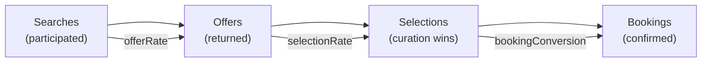

# Intelligence API

The Intelligence API provides suppliers with anonymized competitive positioning data. Suppliers can see how they rank against the marketplace without knowing competitor identities.

## Endpoints

| Endpoint | Method | Purpose |
|----------|--------|---------|
| `/portal/v1/intelligence/price-position` | GET | Price win rate and percentile rank |
| `/portal/v1/intelligence/curation-scores` | GET | Curation selection rate and offer density |
| `/portal/v1/intelligence/conversion-funnel` | GET | Full conversion funnel with rates |
| `/portal/v1/intelligence/routes` | GET | Route-level competitive drilldown |

## Price Position

Returns the supplier's price competitiveness relative to the marketplace. Percentile ranks are computed in real-time by scanning all supplier metrics.

**`GET /portal/v1/intelligence/price-position`**

| Param | Type | Default | Description |
|-------|------|---------|-------------|
| `period` | `weekly` \| `monthly` | `weekly` | Aggregation window |

**Response:**

```json
{
  "success": true,
  "data": {
    "priceWinRate": 34.5,
    "priceWinPercentile": 72,
    "offerRate": 0.85,
    "offerPercentile": 68,
    "totalCompetitors": 12,
    "period": "weekly"
  }
}
```

| Field | Description |
|-------|-------------|
| `priceWinRate` | Percentage of searches where this supplier's price was the lowest |
| `priceWinPercentile` | Rank among all suppliers (0–100, higher = better) |
| `offerRate` | Ratio of offers returned to searches participated in |
| `offerPercentile` | Offer rate rank among competitors |
| `totalCompetitors` | Number of suppliers in the comparison set |

## Curation Scores

Shows how often the curation engine selects this supplier's offers over competitors.

**`GET /portal/v1/intelligence/curation-scores`**

| Param | Type | Default | Description |
|-------|------|---------|-------------|
| `period` | `weekly` \| `monthly` | `weekly` | Aggregation window |

**Response:**

```json
{
  "success": true,
  "data": {
    "selectionRate": 28.3,
    "selectionPercentile": 65,
    "offerDensity": 1.2,
    "totalWins": 142,
    "totalSearches": 502,
    "totalOffers": 603,
    "totalCompetitors": 12,
    "period": "weekly"
  }
}
```

| Field | Description |
|-------|-------------|
| `selectionRate` | Wins / searches, as a percentage |
| `selectionPercentile` | Rank among all suppliers |
| `offerDensity` | Average number of offers returned per search |
| `totalWins` | Absolute number of curation engine selections |

## Conversion Funnel

End-to-end funnel from search participation through booking. Supports custom date ranges.

**`GET /portal/v1/intelligence/conversion-funnel`**

| Param | Type | Default | Description |
|-------|------|---------|-------------|
| `from` | `YYYY-MM-DD` | 30 days ago | Start date |
| `to` | `YYYY-MM-DD` | today | End date |

**Response:**

```json
{
  "success": true,
  "data": {
    "funnel": {
      "searches": 1200,
      "offers": 980,
      "selections": 340,
      "bookings": 85
    },
    "rates": {
      "offersPerSearch": 0.82,
      "selectionRate": 28.3,
      "bookingConversion": 25.0,
      "overallConversion": 7.1
    },
    "period": {
      "from": "2025-04-01",
      "to": "2025-04-30",
      "dataPoints": 30
    }
  }
}
```

### Funnel Stage Definitions



## Route Drilldown

Breaks down competitive performance by origin–destination route. Identifies high, medium, and low competition routes.

**`GET /portal/v1/intelligence/routes`**

| Param | Type | Default | Description |
|-------|------|---------|-------------|
| `period` | `weekly` \| `monthly` | `weekly` | Aggregation window |
| `limit` | `1–50` | `20` | Max routes returned |

**Response:**

```json
{
  "success": true,
  "data": {
    "routes": [
      {
        "route": "DXB-LHR",
        "origin": "DXB",
        "destination": "LHR",
        "searchCount": 350,
        "offerCount": 310,
        "avgOffersPerSearch": 0.89,
        "winCount": 98,
        "winRate": 28.0,
        "avgLatencyMs": 1200,
        "availability": 98.5,
        "errorCount": 2,
        "competitorSearchCount": 1400,
        "competitionLevel": "high"
      }
    ],
    "totalRoutes": 45,
    "period": "weekly",
    "from": "2025-04-21",
    "to": "2025-04-28"
  }
}
```

| Field | Description |
|-------|-------------|
| `competitorSearchCount` | Total searches on this route across all suppliers |
| `competitionLevel` | `high` (5+ suppliers), `medium` (3–4), `low` (1–2) |
| `winRate` | This supplier's win percentage on the route |

:::warning Data Source
Route intelligence reads from the cross-account `alrais-middleware-search-events` table. Data freshness depends on the middleware's event emission pipeline. Expect a lag of up to 5 minutes for real-time search data.
:::
