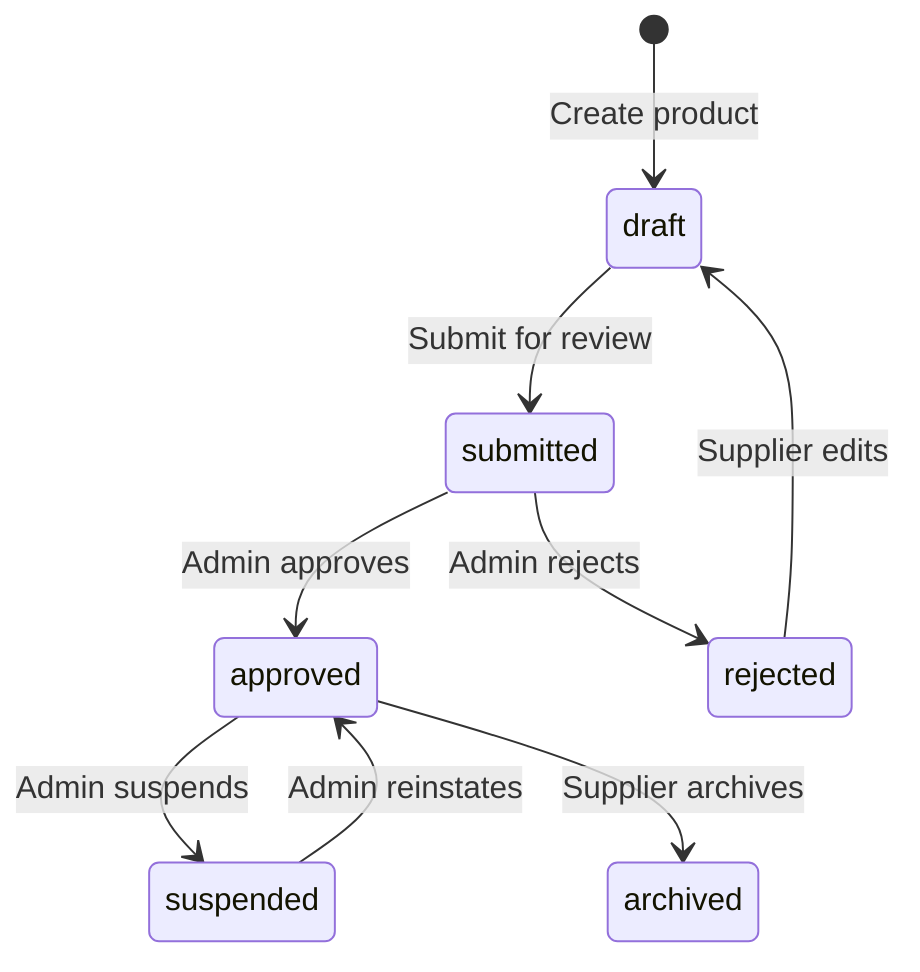

# Product Catalog

The Product Catalog is the core of the supplier marketplace. Suppliers use it to create and manage their product listings — tours, multi-module packages, and airport transfers — that become available to customers on the Al Rais consumer platform once approved.

## How the Marketplace Works

The catalog operates as a **managed marketplace with admin review**. Nothing goes live without approval.

### Supplier Journey

1. **Create** — Supplier builds a product draft with title, description, location, images, cancellation policy, inclusions/exclusions, and type-specific fields (duration for tours, components for packages, vehicle info for transfers)
2. **Set Pricing & Availability** — Supplier defines per-date availability with capacity, start times, and tiered pricing (adult, child, infant, group rates)
3. **Submit** — Supplier submits the draft for admin review. The product moves from `draft` → `submitted`
4. **Admin Reviews** — Platform admin sees the product in their approval queue, inspects all details, and either approves (product goes live) or rejects with a reason
5. **Live on Marketplace** — Approved products appear in consumer search results. The curation engine scores them alongside other suppliers' offerings. Customers can view, compare, and book
6. **Iterate** — Rejected products return to draft. The supplier edits based on the rejection reason and resubmits. Approved products can be updated (availability, pricing) without re-approval

### What Approved Products Power

Once a product reaches `approved` status:
- It appears in consumer **search results** for the relevant destination/category
- The **curation engine** scores it against competing products using price, quality, and supplier reliability factors
- Customers can **book** it — bookings flow through the middleware and appear in the supplier's revenue analytics
- The supplier sees **performance metrics** for the product: impressions, wins, bookings, and revenue

## Endpoints

| Endpoint | Method | Auth | Purpose |
|----------|--------|------|---------|
| `/portal/v1/catalog` | GET | Any role | List supplier's products |
| `/portal/v1/catalog` | POST | `api_manager`+ | Create a new product |
| `/portal/v1/catalog/{productId}` | GET | Any role | Get product details |
| `/portal/v1/catalog/{productId}` | PATCH | `api_manager`+ | Update a draft/rejected product |
| `/portal/v1/catalog/{productId}` | DELETE | `api_manager`+ | Delete a product |
| `/portal/v1/catalog/{productId}/submit` | POST | `api_manager`+ | Submit for approval |
| `/portal/v1/catalog/{productId}/images` | POST | `api_manager`+ | Upload product image |
| `/portal/v1/catalog/{productId}/availability` | GET | Any role | Get availability calendar |
| `/portal/v1/catalog/{productId}/availability` | PUT | `api_manager`+ | Set availability dates |
| `/portal/v1/admin/catalog` | GET | `admin` | List all supplier products |
| `/portal/v1/admin/catalog/{supplierId}/{productId}` | PATCH | `admin` | Approve or reject a product |

## Product Lifecycle



### State Transition Rules

| From | To | Trigger | Who |
|------|----|---------|-----|
| — | `draft` | `POST /catalog` | `api_manager`+ |
| `draft` | `submitted` | `POST /catalog/{id}/submit` | `api_manager`+ |
| `submitted` | `approved` | `PATCH /admin/catalog/{supplierId}/{id}` with `action: "approve"` | `admin` |
| `submitted` | `rejected` | `PATCH /admin/catalog/{supplierId}/{id}` with `action: "reject"` | `admin` |
| `rejected` | `draft` | `PATCH /catalog/{id}` (any edit resets status) | `api_manager`+ |
| `approved` | `suspended` | Admin action | `admin` |

## Admin Review Workflow

When a supplier submits a product, it enters the admin approval queue. Admins access the queue via `GET /admin/catalog` (filtered by `status=submitted`) and review each product.

### What admins check

- **Content quality** — Title, description, images are complete and professional
- **Pricing** — Rates are reasonable for the market and destination
- **Policy clarity** — Cancellation rules are clearly stated
- **Compliance** — Product meets Al Rais marketplace standards

### Approve or reject

**`PATCH /portal/v1/admin/catalog/{supplierId}/{productId}`**

```json
{
  "action": "approve"
}
```

Or with a rejection reason:

```json
{
  "action": "reject",
  "rejectionReason": "Missing images. Please add at least 3 photos showing the activity."
}
```

On rejection, the product returns to `draft` status. The `rejectionReason` is stored on the product record and visible to the supplier, who can address the feedback and resubmit.

:::info Suspension
Admins can also `suspend` an approved product that violates marketplace policies after going live. Suspended products are immediately removed from consumer search results. The admin can later reinstate them.
:::

## Product Types

| Type | Fields | Description |
|------|--------|-------------|
| `tour` | `duration`, `bookingQuestions` | Guided tours with time slots and per-traveler questions |
| `package` | `packageComponents`, `durationNights`, `destination` | Multi-module bundles (flight + hotel + activity) |
| `transfer` | `transferType`, `vehicleType`, `maxPassengers`, `pickupLocation`, `dropoffLocation` | Airport transfers and private cars |

## Create Product

**`POST /portal/v1/catalog`**

```json
{
  "productType": "tour",
  "title": "Dubai Desert Safari",
  "description": "Evening desert safari with BBQ dinner",
  "category": "Adventure",
  "location": {
    "city": "Dubai",
    "countryCode": "AE",
    "meetingPoint": "Hotel lobby pickup"
  },
  "cancellationPolicy": {
    "refundable": true,
    "freeCancellationUntil": "24h",
    "rules": ["Full refund if cancelled 24h before", "50% refund within 24h"]
  },
  "inclusions": ["Hotel pickup", "BBQ dinner", "Camel ride"],
  "exclusions": ["Quad biking", "Falcon photography"],
  "duration": {
    "fixedDurationMinutes": 360,
    "description": "6 hours (4 PM - 10 PM)"
  },
  "bookingQuestions": [
    {
      "questionId": "diet",
      "label": "Dietary requirements",
      "required": false,
      "inputType": "text",
      "scope": "per_booking"
    }
  ]
}
```

**Response (201):**

```json
{
  "success": true,
  "data": {
    "productId": "a1b2c3d4-e5f6-7890-abcd-ef1234567890",
    "productType": "tour",
    "status": "draft",
    "title": "Dubai Desert Safari"
  }
}
```

### Create a Package

Packages bundle multiple travel modules into a single bookable product.

```json
{
  "productType": "package",
  "title": "5-Night Maldives All-Inclusive",
  "description": "Flight from Dubai, 5 nights overwater villa, daily meals, sunset cruise",
  "category": "Beach & Island",
  "destination": "Maldives",
  "durationNights": 5,
  "location": {
    "city": "Male",
    "countryCode": "MV"
  },
  "cancellationPolicy": {
    "refundable": true,
    "freeCancellationUntil": "7d",
    "rules": ["Full refund 7+ days before", "No refund within 7 days"]
  },
  "packageComponents": [
    { "module": "flight", "description": "Return flights DXB-MLE", "included": true },
    { "module": "hotel", "description": "Overwater villa, all meals", "included": true },
    { "module": "activity", "description": "Sunset dolphin cruise", "included": true },
    { "module": "transfer", "description": "Speedboat airport transfer", "included": true }
  ],
  "inclusions": ["Return flights", "5 nights accommodation", "All meals", "Sunset cruise", "Airport transfers"],
  "exclusions": ["Spa treatments", "Scuba diving", "Mini bar"]
}
```

### Create a Transfer

Transfers cover airport pickups, private cars, and shared shuttles.

```json
{
  "productType": "transfer",
  "title": "Private Sedan — DXB Airport to Hotel",
  "description": "Meet & greet at arrivals, direct transfer to any Dubai hotel",
  "category": "Airport Transfer",
  "transferType": "private",
  "vehicleType": "Sedan (Mercedes E-Class or similar)",
  "maxPassengers": 3,
  "location": {
    "city": "Dubai",
    "countryCode": "AE"
  },
  "pickupLocation": {
    "name": "Dubai International Airport (DXB)",
    "address": "Terminal 1/2/3 Arrivals"
  },
  "dropoffLocation": {
    "name": "Any Dubai Hotel",
    "address": "Door-to-door"
  },
  "cancellationPolicy": {
    "refundable": true,
    "freeCancellationUntil": "12h",
    "rules": ["Full refund if cancelled 12h before pickup"]
  },
  "inclusions": ["Meet & greet", "Flight tracking", "60 min free waiting"],
  "exclusions": ["Child seats (available on request)", "Extra stops"]
}
```

## List Products

**`GET /portal/v1/catalog`**

| Param | Type | Description |
|-------|------|-------------|
| `status` | `draft` \| `submitted` \| `approved` \| `rejected` \| `suspended` \| `archived` | Filter by status |
| `type` | `tour` \| `package` \| `transfer` | Filter by product type |

Products are scoped to the authenticated supplier. Admins use `/admin/catalog` for cross-supplier listing.

## Availability Management

### Get Availability

**`GET /portal/v1/catalog/{productId}/availability?from=2025-05-01&to=2025-05-31`**

```json
{
  "success": true,
  "data": {
    "availability": [
      {
        "productId": "a1b2c3d4",
        "date": "2025-05-01",
        "available": true,
        "capacity": 30,
        "booked": 12,
        "startTimes": ["09:00", "14:00", "18:00"],
        "pricing": {
          "adult": { "amount": 250, "currency": "AED" },
          "child": { "amount": 125, "currency": "AED" },
          "group": { "minPax": 6, "maxPax": 12, "pricePerPerson": { "amount": 200, "currency": "AED" } }
        },
        "specialLabel": "Early Bird"
      }
    ]
  }
}
```

### Set Availability

**`PUT /portal/v1/catalog/{productId}/availability`**

Accepts an array of date entries. Existing entries for the specified dates are overwritten.

```json
{
  "dates": [
    {
      "date": "2025-05-15",
      "available": true,
      "capacity": 30,
      "startTimes": ["09:00", "14:00"],
      "pricing": {
        "adult": { "amount": 250, "currency": "AED" }
      }
    }
  ]
}
```

## DynamoDB Schema

### Catalog Table

| Key | Pattern | Example |
|-----|---------|---------|
| PK | `SUPPLIER#{supplierId}` | `SUPPLIER#SUP-001` |
| SK | `PRODUCT#{productId}` | `PRODUCT#a1b2c3d4` |

**GSIs:**
- `StatusIndex`: `status` (HASH) + `updatedAt` (RANGE) — for admin listing by status
- `DestinationIndex`: `city` (HASH) + `status` (RANGE) — for location-based queries

### Availability Table

| Key | Pattern | Example |
|-----|---------|---------|
| PK | `PRODUCT#{productId}` | `PRODUCT#a1b2c3d4` |
| SK | `DATE#{YYYY-MM-DD}` | `DATE#2025-05-01` |
