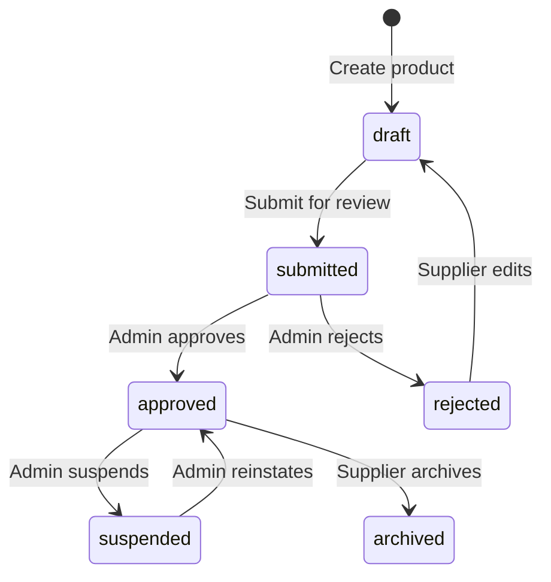

# Product Catalog

The Product Catalog module lets suppliers manage tours, packages, and transfers. Products follow a lifecycle from draft through admin approval to live listing.

## Endpoints

| Endpoint | Method | Auth | Purpose |
|----------|--------|------|---------|
| `/portal/v1/catalog` | GET | Any role | List supplier's products |
| `/portal/v1/catalog` | POST | `api_manager`+ | Create a new product |
| `/portal/v1/catalog/{productId}` | GET | Any role | Get product details |
| `/portal/v1/catalog/{productId}` | PATCH | `api_manager`+ | Update a draft/rejected product |
| `/portal/v1/catalog/{productId}` | DELETE | `api_manager`+ | Delete a product |
| `/portal/v1/catalog/{productId}/submit` | POST | `api_manager`+ | Submit for approval |
| `/portal/v1/catalog/{productId}/images` | POST | `api_manager`+ | Upload product image |
| `/portal/v1/catalog/{productId}/availability` | GET | Any role | Get availability calendar |
| `/portal/v1/catalog/{productId}/availability` | PUT | `api_manager`+ | Set availability dates |
| `/portal/v1/admin/catalog` | GET | `admin` | List all supplier products |
| `/portal/v1/admin/catalog/{supplierId}/{productId}` | PATCH | `admin` | Approve or reject a product |

## Product Lifecycle



### State Transition Rules

| From | To | Trigger | Who |
|------|----|---------|-----|
| — | `draft` | `POST /catalog` | `api_manager`+ |
| `draft` | `submitted` | `POST /catalog/{id}/submit` | `api_manager`+ |
| `submitted` | `approved` | `PATCH /admin/catalog/{supplierId}/{id}` with `action: "approve"` | `admin` |
| `submitted` | `rejected` | `PATCH /admin/catalog/{supplierId}/{id}` with `action: "reject"` | `admin` |
| `rejected` | `draft` | `PATCH /catalog/{id}` (any edit resets status) | `api_manager`+ |
| `approved` | `suspended` | Admin action | `admin` |

## Product Types

| Type | Fields | Description |
|------|--------|-------------|
| `tour` | `duration`, `bookingQuestions` | Guided tours with time slots and per-traveler questions |
| `package` | `packageComponents`, `durationNights`, `destination` | Multi-module bundles (flight + hotel + activity) |
| `transfer` | `transferType`, `vehicleType`, `maxPassengers`, `pickupLocation`, `dropoffLocation` | Airport transfers and private cars |

## Create Product

**`POST /portal/v1/catalog`**

```json
{
  "productType": "tour",
  "title": "Dubai Desert Safari",
  "description": "Evening desert safari with BBQ dinner",
  "category": "Adventure",
  "location": {
    "city": "Dubai",
    "countryCode": "AE",
    "meetingPoint": "Hotel lobby pickup"
  },
  "cancellationPolicy": {
    "refundable": true,
    "freeCancellationUntil": "24h",
    "rules": ["Full refund if cancelled 24h before", "50% refund within 24h"]
  },
  "inclusions": ["Hotel pickup", "BBQ dinner", "Camel ride"],
  "exclusions": ["Quad biking", "Falcon photography"],
  "duration": {
    "fixedDurationMinutes": 360,
    "description": "6 hours (4 PM - 10 PM)"
  },
  "bookingQuestions": [
    {
      "questionId": "diet",
      "label": "Dietary requirements",
      "required": false,
      "inputType": "text",
      "scope": "per_booking"
    }
  ]
}
```

**Response (201):**

```json
{
  "success": true,
  "data": {
    "productId": "a1b2c3d4-e5f6-7890-abcd-ef1234567890",
    "productType": "tour",
    "status": "draft",
    "title": "Dubai Desert Safari"
  }
}
```

## List Products

**`GET /portal/v1/catalog`**

| Param | Type | Description |
|-------|------|-------------|
| `status` | `draft` \| `submitted` \| `approved` \| `rejected` \| `suspended` \| `archived` | Filter by status |
| `type` | `tour` \| `package` \| `transfer` | Filter by product type |

Products are scoped to the authenticated supplier. Admins use `/admin/catalog` for cross-supplier listing.

## Availability Management

### Get Availability

**`GET /portal/v1/catalog/{productId}/availability?from=2025-05-01&to=2025-05-31`**

```json
{
  "success": true,
  "data": {
    "availability": [
      {
        "productId": "a1b2c3d4",
        "date": "2025-05-01",
        "available": true,
        "capacity": 30,
        "booked": 12,
        "startTimes": ["09:00", "14:00", "18:00"],
        "pricing": {
          "adult": { "amount": 250, "currency": "AED" },
          "child": { "amount": 125, "currency": "AED" },
          "group": { "minPax": 6, "maxPax": 12, "pricePerPerson": { "amount": 200, "currency": "AED" } }
        },
        "specialLabel": "Early Bird"
      }
    ]
  }
}
```

### Set Availability

**`PUT /portal/v1/catalog/{productId}/availability`**

Accepts an array of date entries. Existing entries for the specified dates are overwritten.

```json
{
  "dates": [
    {
      "date": "2025-05-15",
      "available": true,
      "capacity": 30,
      "startTimes": ["09:00", "14:00"],
      "pricing": {
        "adult": { "amount": 250, "currency": "AED" }
      }
    }
  ]
}
```

## DynamoDB Schema

### Catalog Table

| Key | Pattern | Example |
|-----|---------|---------|
| PK | `SUPPLIER#{supplierId}` | `SUPPLIER#SUP-001` |
| SK | `PRODUCT#{productId}` | `PRODUCT#a1b2c3d4` |

**GSIs:**
- `StatusIndex`: `status` (HASH) + `updatedAt` (RANGE) — for admin listing by status
- `DestinationIndex`: `city` (HASH) + `status` (RANGE) — for location-based queries

### Availability Table

| Key | Pattern | Example |
|-----|---------|---------|
| PK | `PRODUCT#{productId}` | `PRODUCT#a1b2c3d4` |
| SK | `DATE#{YYYY-MM-DD}` | `DATE#2025-05-01` |
