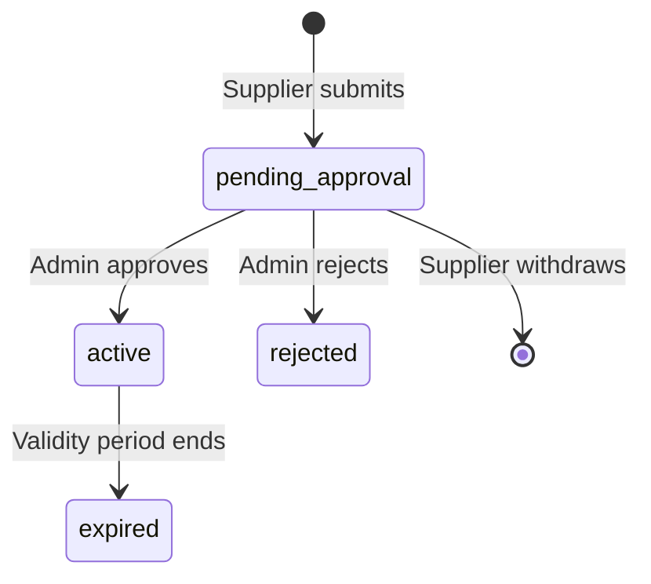

# Rate Management

The rate management module handles negotiated rates (corporate, promotional, seasonal discounts) and blackout dates (periods where the supplier is unavailable on specific routes).

## Endpoints

| Endpoint | Method | Auth | Purpose |
|----------|--------|------|---------|
| `/portal/v1/rates` | GET | Any role | List negotiated rates |
| `/portal/v1/rates` | POST | `api_manager`+ | Submit a new rate |
| `/portal/v1/rates/{rateId}` | DELETE | `api_manager`+ | Withdraw a pending rate |
| `/portal/v1/blackouts` | GET | Any role | List blackout dates |
| `/portal/v1/blackouts` | POST | `api_manager`+ | Create a blackout window |
| `/portal/v1/blackouts/{blackoutId}` | DELETE | `api_manager`+ | Remove a blackout |

## Negotiated Rates

### Rate Types

| Type | Description | Use Case |
|------|-------------|----------|
| `corporate` | Fixed discount for corporate accounts | B2B contract pricing |
| `promotional` | Time-limited promotional discount | Seasonal campaigns, flash sales |
| `seasonal` | Recurring seasonal pricing adjustments | Peak/off-peak pricing |

### Rate Lifecycle



### Submit Rate

**`POST /portal/v1/rates`**

```json
{
  "rateType": "promotional",
  "module": "flight",
  "routes": ["DXB-LHR", "DXB-CDG"],
  "discountPercent": 12.5,
  "validFrom": "2025-06-01",
  "validTo": "2025-08-31"
}
```

| Field | Type | Required | Validation |
|-------|------|----------|------------|
| `rateType` | `corporate` \| `promotional` \| `seasonal` | Yes | — |
| `module` | `flight` \| `hotel` \| `activity` \| `transfer` | Yes | Travel vertical |
| `routes` | `string[]` | Yes | Non-empty array of route codes |
| `discountPercent` | number | Yes | 0–100 |
| `validFrom` | ISO date | Yes | Must be a valid future date |
| `validTo` | ISO date | Yes | Must be after `validFrom` |

**Response (201):**

```json
{
  "success": true,
  "data": {
    "rateId": "r1a2b3c4-d5e6-7890-abcd-ef1234567890",
    "status": "pending_approval",
    "submittedAt": "2025-04-28T10:00:00Z",
    "message": "Rate submitted for admin approval."
  }
}
```

### List Rates

**`GET /portal/v1/rates`**

Returns all negotiated rates for the authenticated supplier, across all statuses.

```json
{
  "success": true,
  "data": {
    "rates": [
      {
        "rateId": "r1a2b3c4",
        "rateType": "promotional",
        "module": "flight",
        "routes": ["DXB-LHR", "DXB-CDG"],
        "discountPercent": 12.5,
        "validFrom": "2025-06-01",
        "validTo": "2025-08-31",
        "status": "pending_approval",
        "submittedAt": "2025-04-28T10:00:00Z"
      }
    ]
  }
}
```

### Withdraw Rate

**`DELETE /portal/v1/rates/{rateId}`**

Only `pending_approval` rates can be withdrawn. Active or expired rates cannot be deleted.

```json
{
  "success": true,
  "data": {
    "rateId": "r1a2b3c4",
    "message": "Rate withdrawn"
  }
}
```

### Admin Approval

Admins approve or reject rates through the pending approvals endpoint:

**`PATCH /portal/v1/admin/rates/{supplierId}/{rateId}`**

```json
{
  "action": "approve",
  "reason": "Competitive discount for summer campaign"
}
```

On approval, the rate transitions to `active` and is applied to the pricing engine for the specified routes during the validity window.

## Blackout Dates

Blackout dates define periods where the supplier cannot fulfill bookings on specific routes. The middleware respects blackout windows and excludes the supplier from search results during those dates.

### Create Blackout

**`POST /portal/v1/blackouts`**

```json
{
  "module": "hotel",
  "routes": ["DXB"],
  "startDate": "2025-12-20",
  "endDate": "2026-01-05",
  "reason": "Peak season — fully booked, no inventory available"
}
```

| Field | Type | Required | Validation |
|-------|------|----------|------------|
| `module` | `flight` \| `hotel` \| `activity` \| `transfer` | Yes | Travel vertical |
| `routes` | `string[]` | Yes | Non-empty; can be single city or route pair |
| `startDate` | `YYYY-MM-DD` | Yes | Must be valid date |
| `endDate` | `YYYY-MM-DD` | Yes | Must be after `startDate` |
| `reason` | string | Yes | Explanation for the blackout |

**Response (201):**

```json
{
  "success": true,
  "data": {
    "blackoutId": "b1c2d3e4-f5a6-7890-abcd-ef1234567890",
    "createdAt": "2025-04-28T11:00:00Z",
    "message": "Blackout window created."
  }
}
```

### List Blackouts

**`GET /portal/v1/blackouts`**

Returns all active and future blackout windows for the authenticated supplier.

### Remove Blackout

**`DELETE /portal/v1/blackouts/{blackoutId}`**

Immediately removes the blackout window. The supplier will be included in search results for those dates again.

## DynamoDB Schema

### Negotiated Rates

| Key | Pattern | Example |
|-----|---------|---------|
| PK | `SUPPLIER#{supplierId}` | `SUPPLIER#SUP-001` |
| SK | `RATE#{rateId}` | `RATE#r1a2b3c4` |

### Blackout Dates

| Key | Pattern | Example |
|-----|---------|---------|
| PK | `SUPPLIER#{supplierId}` | `SUPPLIER#SUP-001` |
| SK | `BLACKOUT#{blackoutId}` | `BLACKOUT#b1c2d3e4` |
