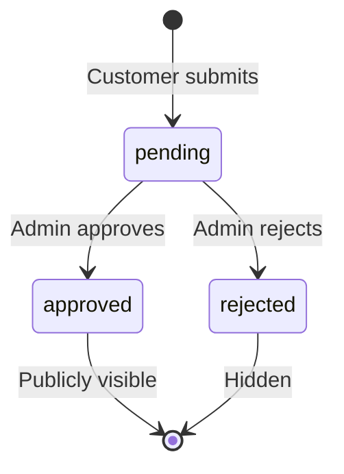

# Reviews

The reviews system lets customers submit ratings and written reviews for products. All reviews go through a moderation workflow before becoming publicly visible.

## Endpoints

| Endpoint | Method | Auth | Purpose |
|----------|--------|------|---------|
| `/portal/v1/reviews` | POST | Any authenticated user | Submit a review |
| `/portal/v1/reviews` | GET | Any authenticated user | List reviews for a product |
| `/portal/v1/admin/reviews/{reviewId}` | PATCH | `admin` | Approve or reject a review |

## Review Lifecycle



## Submit Review

**`POST /portal/v1/reviews`**

```json
{
  "productId": "a1b2c3d4-e5f6-7890-abcd-ef1234567890",
  "productType": "tour",
  "bookingReference": "BK-2025-001",
  "rating": 4,
  "title": "Great desert safari experience",
  "text": "The pickup was on time and the BBQ dinner was excellent. Camel ride was a highlight."
}
```

| Field | Type | Required | Validation |
|-------|------|----------|------------|
| `productId` | string | Yes | Must reference an existing product |
| `productType` | string | Yes | Product category identifier |
| `bookingReference` | string | No | Optional booking ID for verification |
| `rating` | number | Yes | Integer 1–5 |
| `title` | string | Yes | Review headline |
| `text` | string | Yes | Review body |

**Response (201):**

```json
{
  "success": true,
  "data": {
    "reviewId": "f1e2d3c4-b5a6-7890-abcd-ef1234567890",
    "status": "pending",
    "message": "Review submitted and pending moderation."
  }
}
```

## List Reviews

**`GET /portal/v1/reviews`**

| Param | Type | Default | Description |
|-------|------|---------|-------------|
| `productId` | string | **required** | Product to fetch reviews for |
| `status` | string | `approved` | Filter by review status |

Non-admin users can only retrieve `approved` reviews. Admins can filter by `pending` or `rejected` to see the moderation queue.

**Response:**

```json
{
  "success": true,
  "data": [
    {
      "reviewId": "f1e2d3c4",
      "rating": 4,
      "title": "Great desert safari experience",
      "text": "The pickup was on time and the BBQ dinner was excellent.",
      "submittedAt": "2025-04-25T10:30:00Z",
      "productType": "tour"
    }
  ],
  "meta": {
    "productId": "a1b2c3d4",
    "status": "approved",
    "count": 1
  }
}
```

## Moderation

:::warning Admin only
Review moderation requires the `admin` role.
:::

**`PATCH /portal/v1/admin/reviews/{reviewId}`**

```json
{
  "productId": "a1b2c3d4-e5f6-7890-abcd-ef1234567890",
  "action": "approve",
  "reason": "Verified purchase, appropriate content"
}
```

| Field | Type | Required | Description |
|-------|------|----------|-------------|
| `productId` | string | Yes | Product the review belongs to (used for DynamoDB lookup) |
| `action` | `approve` \| `reject` | Yes | Moderation decision |
| `reason` | string | No | Moderation note (recommended for rejections) |

**Response:**

```json
{
  "success": true,
  "data": {
    "reviewId": "f1e2d3c4",
    "status": "approved",
    "moderatedBy": "admin@supplier.com",
    "moderatedAt": "2025-04-26T09:00:00Z"
  }
}
```

## DynamoDB Schema

| Key | Pattern | Example |
|-----|---------|---------|
| PK | `PRODUCT#{productId}` | `PRODUCT#a1b2c3d4` |
| SK | `REVIEW#{reviewId}` | `REVIEW#f1e2d3c4` |

**GSIs:**
- `StatusIndex`: `status` (HASH) + `submittedAt` (RANGE) — for moderation queue listing
- `UserIndex`: `userId` (HASH) + `submittedAt` (RANGE) — for per-user review history

**Stored Fields:**
`reviewId`, `userId`, `userEmail`, `productType`, `bookingReference`, `rating`, `title`, `text`, `status`, `submittedAt`, `moderatedBy`, `moderatedAt`, `moderationReason`
